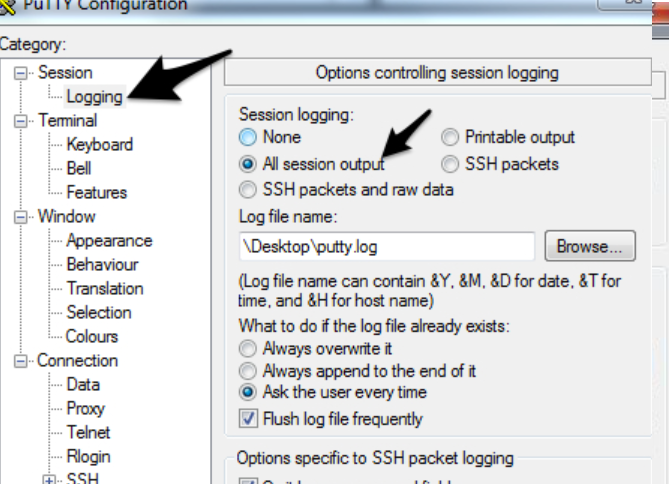

# Collecting Cisco Switch Logs   
## Windows-Putty
### Using Putty
Enter the IP or hostname of the CISCO or Brocade switch:

Make sure logging is turned on for "All session output" and then save the resulting putty.log file to a location of your choice. It is helpful to make the log something relevant  unlike my example

